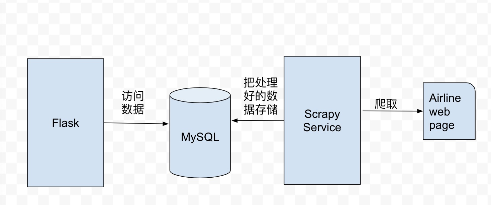

airlines prices ongoing
this project will show you the airplane ticket in different air company
in the very last hour .

so ,the construct of this project is:
scrapy+flask+mysql+elasticsearch

Below here is the project architecture 

we will be very happy if you want to coding with us.
ok ,let's go!

Kind Reminder:

    you'd better use pycharm professional version ,because professional verison can help you 
create the archetecture of flask.
    install flask in a virtual enviroment.
    first,create a pacakage in your disk,eg:Virtuale,then install these packages,below here 
is the shell to install

    pip install flask 　　
    pip install flask-login 　　
    pip install flask-openid 　　
    pip install flask-sqlalchemy 　　
    pip install sqlalchemy-migrate 　　
    pip install flask-whooshalchemy 　　
    pip install flask-wtf 　　
    pip install flask-babel 　　
    pip install flup